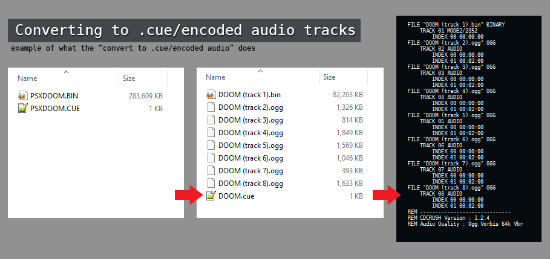

# CDCRUSH nodeJS

**Name**: cdcrush, *Highy compress cd-image games*\
**Author:** John Dimi :computer:, <johndimi@outlook.com> *twitter*: [@jondmt](https://twitter.com/jondmt)\
**Project Page and Sources:** [https://github.com/johndimi/cdcrush](https://github.com/johndimi/cdcrush.net)\
**Language:** HAXE compiled to nodeJS, **Licence:** MIT\
**Version:** 1.4 **Platform:** Windows
**Sister Project**: [cdcrush.net](https://github.com/johndimi/cdcrush.net)

## :mega: What is it

**cdcrush** is a tool that can highly compress **CD based games** *( playstation 1, Pc-engine, etc )* for storage / sharing purposes. **ALSO** it can encode the audio tracks of a CD and create a `.cue` file with *(mp3/ogg/flac)* tracks for use in emulators.

**⇒ How does it compress/crush a CD :** 

- The program separates the tracks of a CD image and compress them separately.
- For **data** tracks it will use **ecm tools** to remove Error Correction/Detection Codes (ECC/EDC) data from the sectors. *( redundant data )*
- For **audio** tracks, it will use an encoder of your choice. You can select a lossy encoder like (**opus** or **vorbis**) to produce a decent quality audio file with a much smaller filesize compared to the uncompressed PCM audio original.
- **OR** you can choose to encode audio with **FLAC**  which is lossless.
- Finally it compresses everything into a single `.arc` archive using the **FreeArc** archiver.
 
 **⇒ Restoring a crushed CD :**
 
**cdcrush**  can  **restore** the crushed CD image back to it's original form, a **.bin/.cue** image that is ready to be used however you like.  

**NOTE**: Archives with the audio tracks encoded with **FLAC**, will be restored to a 1:1 copy, byte for byte, of the original source CD
 
 
 
### Some examples of game sizes archived with 7zip and cdcrush:

| Title             |  Raw    | 7z      | cdcrush-ogg|  cdcrush-flac |
| ----------------- | ------- | ------  | -----------  | -------|
| Tomb Raider 2     |  710MB  |  ~ 455MB  | **150MB**  | **320MB** |
| Wipeout 3         |  577MB  |  ~ 490MB  | **77MB**   | .|
| Die Hard Trilogy  |  532MB  |  ~ 450MB  | **71MB**   | .|
| Alien Trilogy     |  507MB  |  ~ 440MB  | **88MB**   | .|

Those games feature many CD-DA audio tracks
7zip maximum compression default template

## :paperclip: General Info
- **cdcrush** is only compatible with `.cue/.bin` type CD images. Some programs that allow you to rip your CDs to this format are:
  - [cdrtfe](https://cdrtfe.sourceforge.io/cdrtfe/index_en.html), open source
  - [ImgBurn](http://imgburn.com), free but not open source.
- This is a **CLI** application. Some basic CLI knowledge is required. 
- There is also a [dotNet version of cdcrush](https://github.com/johndimi/cdcrush.net) it's simpler to use, but it doesn't support batch operations.
- Compressing a CD with **cdcrush** produces an archive file with the `.arc` extension. This is the same extension the archiver *freearc* uses.

## :large_blue_diamond: Installing cdcrush

1. Get [nodeJS](https://nodejs.org/en/) (version 8+) and make sure **npm** is also installed *(NodeJs installer should install npm)*
2. On a terminal type : `npm install -g cdcrush`\
This will install cdcursh globally and you can use it from anywhere.
3. Get and Install [ffmpeg](http://ffmpeg.org/). It is a free and open source program required to encode audio tracks.\
:warning: **FFmpeg NEEDS to be set on PATH** . The easiest way to do this is to copy `ffmpeg.exe` into your `c:\windows` folder. 
4. That's it. **cdcrush** is ready to go.

 Calling cdcrush alone doesn't do much, you need to define some arguments

## :vertical_traffic_light: Running, Program arguments

After installing **cdcrush** with npm, you can run it from anywhere in a terminal by typing\
**`cdcrush`**

The basic format of arguments is:\
**`cdcrush <input files> <action> <options> -o <output dir>`**

*You can always run `cdcrush -help` for a quick help.*

### :file_folder: Input / Output

- **Input Files** ⇒ You can use `.cue` or `.arc` files. Wildcards are supported. `*.cue, *.*`\
- **Output Dir** ⇒ Set with `-o` followed by `output dir`\
Setting an output directory is **optional**. If you skip it, it will automatically be set to the same folder as the **input file**.\
- **Examples**\
`cdcrush *.arc -o c:\games\`  *To restore multiple files on same folder as input file*\
`cdcrush game1.arc game2.arc -o c:\games\`*To restore selected files into c:\games*

### :green_book: ACTIONS 
You can only set **one** action at a time :
-  :arrows_clockwise: **Restore** ⇒ Set with **`r`**\
Will restore an archive back to `cue/bin` files.
- :cd: **Crush** ⇒ Set with **`c`**\
Will compress a `cue/bin` CD into an `.arc` cdcrush archive. 
- :warning: You can **skip** setting an action and it will be auto guessed from the inut file extension 
`.arc` will autoselect **restore** and `.cue` will autoselect **crush** actions

e.g.
`cdcrush r game.arc` ⇒ *will restore game.arc back to bin/cue*\
`cdcrush game.arc` ⇒ *will also restore game.arc back to bin/cue. The action was guessed from the filename*

### :orange_book: OPTIONS

You can set as many options as you'd like.

- **Subfolder** ⇒ set with `-folder`\
Only works with **RESTORE**. Will **restore** an archive to a **subfolder** in the **output dir**\
e.g. `cdcrush game.arc -folder -o c:\games` ⇒\
Will create the folder `c:\games\game_(r)` and will restore the CD there.

- **Encoded Audio Files/Cue** ⇒ set with `-enc`\
Will **restore** or **crush** into a `.cue` with encoded audio tracks. This is to use with some emulators that support this kind of `.cue` CDs\. Works with **restore**  and **crush**.  **Autocreates subfolder** on the output dir. e.g.\
`cdcrush game.cue -enc` ⇒ *Will encode all audio tracks and create a new .cue file in a subdirectory*

- **Force Single Bin** ⇒ set with `-single`\
Works in **RESTORE** only. Will produce a **SINGLE** .bin file even if the source CD had multiple .bin files. (*Cannot be used with `-enc`*)

- **Audio Codec** ⇒ set with `-ac` followed by `codec id`\
:warning: if you don't set an audio codec it defaults to `flac`
Codec IDs:
  - `flac` : Flac Lossless. Using this, you can store a 1:1 lossless copy of the entire CD
  - `opus` : Opus Ogg codec with vbr\*, is an advanced codec and can produce really nice quality audio even at low bitrates.
  - `vorbis`: Vorbis Ogg codec with vbr\* , slightly inferior to Opus, but it is compatible with emulators running CUE files with Vorbis encoded audio.
  - `mp3` : MP3 with vbr\* , is not recommended but it's there.\
vbr = variable bit rate

- **Audio Quality** ⇒ set with `-aq` followed by a number `0-10`. \
0 is the lowest quality and 10 is the highest quality. Applicable in lossy codecs as `mp3`,`opus` and `vorbis`. **Flac** doesn't require this option.\
:warning: If you don't set this while you select a lossy codec, it will **default to (4)**

- **Compression Level** ⇒ set with `-cl` followed by a number `0-9`.\
Sets the compression level of the final archive on the **crush** operations. \
`0` is the fastest but offers minimum compression
`9` offers the best compression, but requires a **:bomb: HUGE AMOUNT OF RAM** for both compressing and decompression.  *(don't ever use)*
:pushpin: The **default value** is `4` which offers a good compression ratio vs memory usage and time required.

- **Temp Folder** ⇒ set with `-temp` followed by a `path`\
Sets the temp folder for use in operations. **It defaults** to the OS default `%TEMP%` folder. Useful if you want to use a ramdrive. Make sure it can hold up to 1.2GB of data.

- **Max Threads** ⇒ set with `-threads` followed by a number `1-8`\
Set the maximum number of concurrent processes for encoding tracks. **Defaults to 2** Don't set this bigger than the number of logical cores you  have.

- **Log File** ⇒ set with `-log`followed by a `file` (*the file will be created*)\
Will log everything to that file, updating it in real time. Also you can see the checksums of the tracks in that log file. **Defaults to no log file**

## :cd: Converting to .cue/encoded audio

You can **convert** a `.cue/.bin` CD, into another `.cue/.bin` combo with **encoded audio tracks called from the cue file**. This is really useful if you want to play a CD in an emulator that supports loading `.cue` files with encoded audio tracks (*e.g. mednafen supports libvorbis and FLAC audio*)

Just use the option `-enc` with the **crush** or **restore** action. *(For when using it with the restore action, the audio tracks will not be re-encoded, they will just be left as they were when originally encoded.)*

Example of what this operation does.

## :exclamation: CHANGELOG
See [`CHANGELOG.MD`](CHANGELOG.MD)

## :hammer: BUILDING
See [`BUILDING.MD`](BUILDING.MD)

## :clipboard: Q&A

**Q** : Why?\
**A** : I wanted to save space on my hard drive and I think it's a decent way to store CD images, better than just compressing with 7zip or Rar. Also It was a good programming practice.

**Q** : Does it support games from SegaCD, Jaguar, 3DO, X, Y?\
**A** : Theoretically it should support all valid **.cue/.bin** files, try it out.

**Q** : I am worried about the audio quality.\
**A** : The OGG Vorbis/Opus codec is decent and it can produce very good results even at 96kbps. **However** if you don't want any compressed audio you can select the **FLAC** encoder, which is lossless.

**Q**: Is storing the entire CD with FLAC really lossless? I am worried about byte integrity.\
**A**: YES, to the last byte. The filesize and checksums of the restored tracks are the same as the original ones. (data&audio). You can check for yourself by calculating the checksums of restored files vs original source. 

## :stars: dotNET Version

Checkout the  [dotNet version](https://github.com/johndimi/cdcrush.net), it's simpler to use, but it doesn't support batch operations. *Windows Only*

## :triangular_flag_on_post: About

Feel free to provide feedback and contact me on social media and email. Donations are always welcome! :smile:

Thanks for checking this out,\
John.
